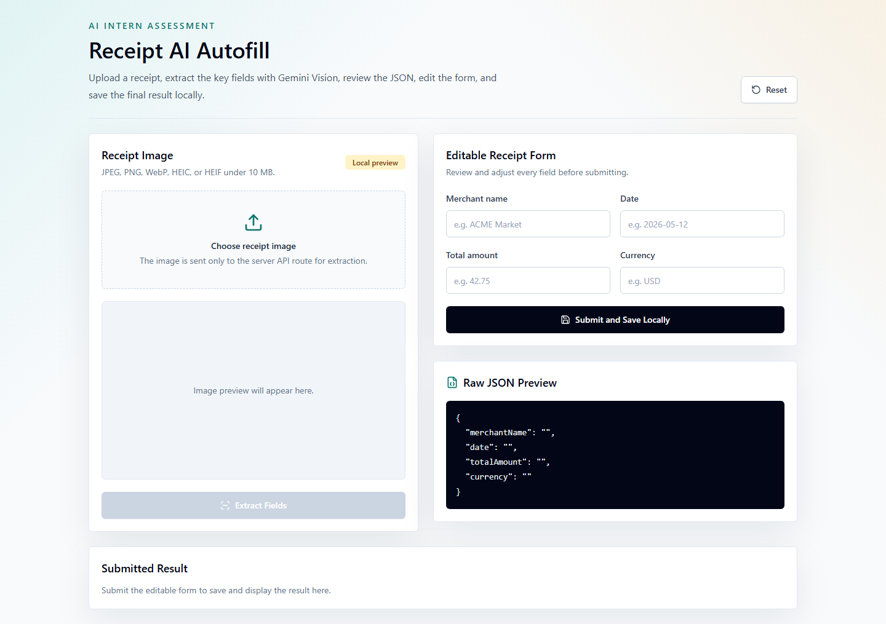

# Receipt AI Autofill

AI Intern assessment submission: a Next.js App Router application that uploads a receipt image, extracts structured receipt data with Gemini Vision, auto-fills an editable form, and saves the reviewed submission locally in the browser.

The project focuses on a practical AI-assisted workflow: use the model for first-pass extraction, keep the API key server-side, show the raw JSON for transparency, and let the user correct the final data before saving.

## Live Demo

https://receipt-ai-autofill-eta.vercel.app

## Demo Summary

- Upload a receipt image: JPEG, PNG, WebP, HEIC, or HEIF.
- Validate file type and size before sending it to the server.
- Preview the selected receipt in the browser.
- Extract `merchantName`, `date`, `totalAmount`, and `currency` with Gemini.
- Display the model output as raw JSON.
- Auto-fill an editable form for human review.
- Save the final reviewed receipt in `localStorage`.
- Reset the workflow at any time.

## Tech Stack

- **Framework:** Next.js App Router
- **Language:** TypeScript
- **Styling:** Tailwind CSS
- **Icons:** Lucide React
- **AI Model:** `gemini-2.5-flash`
- **Server Layer:** Next.js route handler at `/api/extract`
- **Client Persistence:** Browser `localStorage`

## Architecture Overview

```text
Browser UI
  |
  | 1. User uploads receipt image
  v
Client Component: app/page.tsx
  |
  | 2. Sends multipart form data to internal API route
  v
Server Route: app/api/extract/route.ts
  |
  | 3. Validates image and reads GEMINI_API_KEY from server env
  v
Gemini Vision API
  |
  | 4. Returns structured receipt JSON
  v
Server Route normalizes and validates response
  |
  | 5. Client receives extracted fields
  v
Editable Review Form + Raw JSON Preview
  |
  | 6. User submits reviewed result
  v
localStorage
```

### Key Files

| File | Purpose |
| --- | --- |
| `app/page.tsx` | Main client-side upload, preview, extraction, editing, submission, and reset workflow. |
| `app/api/extract/route.ts` | Server-only Gemini integration, image validation, prompt construction, response parsing, and error handling. |
| `app/layout.tsx` | App metadata and root layout. |
| `app/globals.css` | Tailwind setup and global visual styling. |
| `.env.example` | Documents the required server-side Gemini API key. |

## Project Flow

1. The user selects a receipt image from their device.
2. The client validates the MIME type and enforces the 10 MB image limit.
3. The selected image is previewed locally with `URL.createObjectURL`.
4. The user clicks **Extract Fields**.
5. The client sends the image as `FormData` to `/api/extract`.
6. The API route checks `GEMINI_API_KEY`, validates the uploaded file, converts the image to base64, and sends it to Gemini.
7. Gemini is prompted to return JSON only with the required receipt fields.
8. The server strips possible code fences, parses the response, and normalizes missing values to empty strings.
9. The client displays the raw JSON and fills the editable form.
10. The user reviews or edits the values, then submits the final receipt.
11. The submitted result is saved to `localStorage` and rendered below the form.

## Screenshots

### Upload And Review Screen



The screenshot above shows the initial upload and editable review interface. Add more captures to `docs/screenshots/` if your assessment platform accepts multiple images.

Recommended captures:

| Screenshot | What It Should Show |
| --- | --- |
| `docs/screenshots/upload-state.png` | Initial upload screen with the receipt image panel and empty editable form. |
| `docs/screenshots/extracted-fields.png` | A receipt preview, raw JSON response, and auto-filled form fields after extraction. |
| `docs/screenshots/submitted-result.png` | The reviewed submitted result saved and displayed below the form. |

Suggested Markdown once screenshots are added:

```md


```

## Environment Variables

Create `.env.local` in the project root:

```bash
GEMINI_API_KEY=your_gemini_api_key_here
```

Do not prefix the key with `NEXT_PUBLIC_`. The key must remain server-only and is read only inside `app/api/extract/route.ts`.

## Local Development

Install dependencies:

```bash
npm install
```

Create the environment file:

```bash
cp .env.example .env.local
```

Start the development server:

```bash
npm run dev
```

Open [http://localhost:3000](http://localhost:3000).

On Windows PowerShell, if `npm` is blocked by execution policy, use:

```powershell
npm.cmd install
npm.cmd run dev
```

## Available Scripts

| Command | Description |
| --- | --- |
| `npm run dev` | Starts the local Next.js development server. |
| `npm run build` | Creates a production build. |
| `npm run start` | Runs the production build after `npm run build`. |
| `npm run typecheck` | Runs TypeScript validation with `tsc --noEmit`. |

## Gemini Prompt

The server route uses a strict extraction prompt that asks Gemini to return only valid JSON:

```text
You are a receipt extraction engine.

Extract the following fields from the receipt image:
- merchantName
- date
- totalAmount
- currency

Return valid JSON only with exactly these keys:
{
  "merchantName": "",
  "date": "",
  "totalAmount": "",
  "currency": ""
}

Rules:
- Do not include markdown, comments, explanations, or extra keys.
- If a field is unclear or not visible, return an empty string for that field.
- Use the receipt transaction date when available.
- Return totalAmount as the final amount paid, including tax, tips, and discounts when shown.
- Return currency as the ISO 4217 code when clear, otherwise the visible currency symbol, otherwise an empty string.
```

## Deployment Instructions

### Vercel

1. Push the project to a Git repository.
2. Import the repository into Vercel.
3. Add `GEMINI_API_KEY` in **Project Settings > Environment Variables**.
4. Deploy with the default Next.js settings.
5. Verify `/api/extract` works with a real receipt image after deployment.

### Other Next.js Hosts

Use any platform that supports Next.js server routes, such as Netlify or a Node-based host.

1. Install dependencies with `npm install`.
2. Build the app with `npm run build`.
3. Start the production server with `npm run start`.
4. Configure `GEMINI_API_KEY` as a server-side environment variable.

### Production Notes

- The app uses server-side API routes, so it cannot be deployed as a purely static export.
- Uploaded images are sent inline as base64 to Gemini, so the 10 MB limit should remain in place.
- `localStorage` is browser-only persistence; no server database is required for this assessment version.

## Limitations

- Extraction accuracy depends on receipt quality, lighting, angle, and text visibility.
- The app extracts only four fields: merchant name, date, total amount, and currency.
- Only one submitted result is stored locally; each new submission replaces the previous one.
- The app has no authentication, user accounts, or cross-device sync.
- Uploaded images are processed through the server route but are not permanently stored.
- Very large or multi-page receipts would need a file-upload workflow instead of inline base64.

## Future Improvements

- Add automated tests for file validation, API error handling, and form submission.
- Add support for line items, taxes, tips, receipt number, payment method, and merchant address.
- Store reviewed receipts in a database with user authentication.
- Add export options such as CSV, JSON, or accounting-system integrations.
- Add confidence scores and field-level review indicators.
- Add drag-and-drop upload and mobile camera capture.
- Add OCR fallback or retry logic for low-confidence model responses.
- Add screenshot assets and a short demo video for submission polish.

## Assessment Notes

This implementation keeps the AI integration behind a server boundary, validates user input before model calls, handles malformed model output defensively, and keeps the user in control of the final submitted data. The result is intentionally small but production-minded: clear boundaries, typed data flow, explicit error states, and a review step before persistence.
